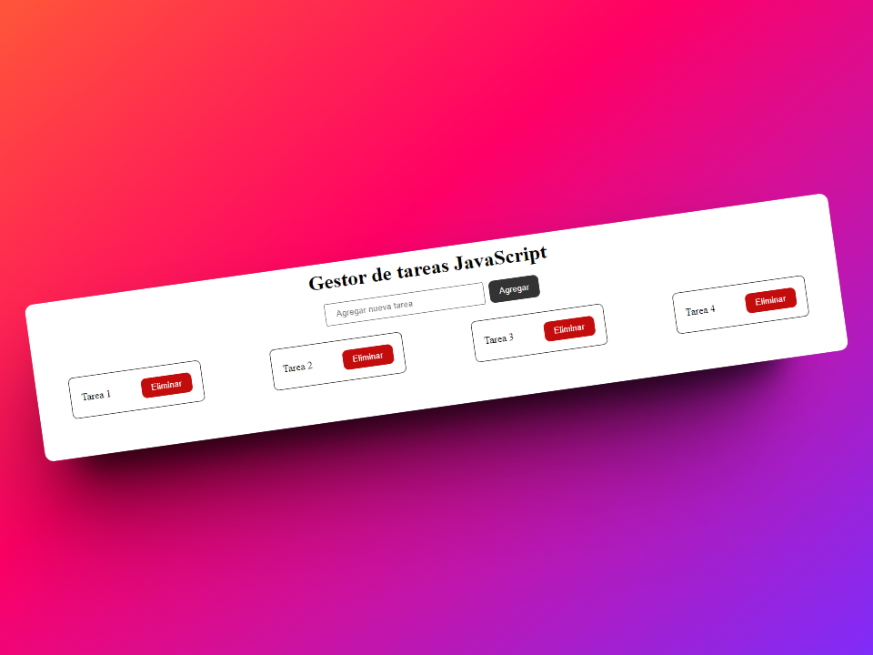
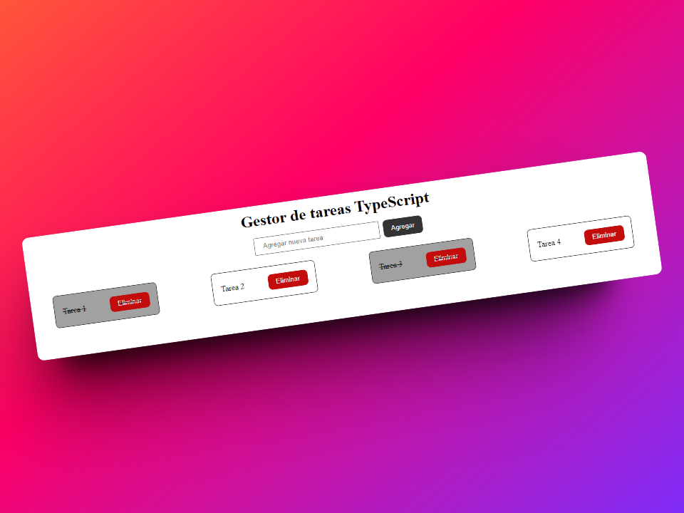

# 📷 Capturas de Pantallas

# AHD4 - Proyecto del curso FullStack INTECAP

Proyecto realizada como parte del curso de Desarrollador FullStack por INTECAP, como parte de una beca otorgada. La práctica consiste en el desarrollo de un gestor de tareas desarrollado con JavaScript y TypeScript, diseñado para permitir a los usuarios agregar, completar y eliminar tareas.

## 🛠️ Tecnologías Utilizadas

|  |  |  |  |
| :----------------------------------------------------------------------------------------------------: | :------------------------------------------------------------------------------------------------: | :----------------------------------------------------------------------------------------------------------------: | :----------------------------------------------------------------------------------------------------------------: |

## Uso
Una vez que el proyecto este funcionando en el navegador, el usuario puede: 
 - Agregar nuevas tareas utilizando el formulario proporcionado.
 - Marcar las tareas como completadas haciendo click sobre la tarea correspondiente.
 - Eliminar tareas haciendo click en el botón de eliminar junto a cada tarea

## Enlaces

- Pagina hecha con JavaScript: [Gestor de tareas JavaScript](https://gestor-tareas-javascript.netlify.app/)

- Pagina hecha con TypeScript: [Gestor de tareas TypeScript](https://gestor-tareas-typescript.netlify.app/)